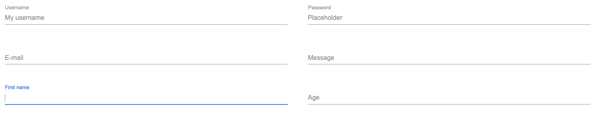

# Material Input

Material input is a vanilla javascript plugin that allows you to create
material inputs easily.

[](https://androlax2.github.io/material-input/)

Here is a [demo](https://androlax2.github.io/material-input/)

## Installation

### Direct Download

You can [download the files directly from Github](MaterialInput.js).

```html
<script src="path/to/MaterialInput.js"></script>
```

## Usage

### Getting Started

You have now access to a new **custom element** :

```html
<material-input></material-input>
```

### Markup

All you need to do is to put in the HTML code the custom element. Be
careful, Material Input require 3 attributes :

- `name` : The name of the input, will be used server side with POST or
  GET variable for example.
- `type` : The type of the input. It's typically the type of the input
  (text, textarea, number, ...). Material Input only supports
  [those](#supported-types).
- `label` : The label of the input. It's the text that will be display
  on the input and will transition upper when users will enter texts.

For the others attributes, you can put all the usual attributes of an
input element.

You can set `value` attribute to the Material Input to put a default
value or to get back data users posted if the validation failed for
example you could do something like this :

```html
<material-input label="Username" name="username" type="text" value="<?php echo $_POST['username'] ?: null; ?>"></material-input>
```

#### Text input

```html
<material-input label="Username" name="username" type="text"></material-input>
```

#### Email input

```html
<material-input label="E-mail" name="email" type="email"></material-input>
```

#### Textarea input

```html
<material-input label="Message" name="message" type="textarea"></material-input>
```

#### Password input

```html
<material-input label="Password" name="password" type="password"></material-input>
```

#### Number input

```html
<material-input label="Age" name="number" type="number"></material-input>
```

#### Tips

Wrap the custom element in a div, Material Input will create an hidden
input to be sure the form send with the data correctly, you can do
something like this :

```html
<div class="materialInputWrapper">  
    <material-input label="Username" name="username" type="text"></material-input>
    <!-- Here will be the place of the hidden input -->
</div>
```

If you don't do that, you will have a problem for example if you want to
uses CSS Grid, or Flex, as in your HTML code there will be only the
`<material-input></material-input>` element. But there will be an hidden
input right after it.

### Validating

You can use all the usual attributes to validate an input (required,
minlength, maxlength, ...)

### Styling

You can style Material Input thanks to those variables :

```css
material-input {
    /* LABEL AND INPUT */
    --materialInput__fontFamily: Arial, Helvetica, sans-serif;
    --materialInput__fontColor: #9e9e9e;
    --materialInput__fontLetterSpacing: 0;
    
    /* ACTIVE LABEL */
    --materialInput__labelActiveColor: #4285f4;
    
    /* BORDER */
    --materialInput__borderWidth: 1px;
    --materialInput__borderColor: #9e9e9e;
    --materialInput__borderColorActive: #4285f4;
    
    /* OTHER BORDERS */
    --materialInput__borderTopWidth: 0em;
    --materialInput__borderRightWidth: 0em;
    --materialInput__borderLeftWidth: 0em;
    
    /* BORDER TRANSITION */
    --materialInput__borderRemoveTransitionDelay: .3s;
    --materialInput__borderRemoveTransition: cubic-bezier(0.4, 0, 0.2, 1);
    --materialInput__borderAddTransitionDelay: .3s;
    --materialInput__borderAddTransition: cubic-bezier(0.4, 0, 0.2, 1);
    
    /* PADDING TOP */
    --materialInput__paddingTop: 0.6em; /* If you want to remove this, you need to set 0em */
    
    /* INPUT STYLE */
    --materialInput__inputBackgroundColor: transparent;
    --materialInput__inputBorderRadius: 0;
    --materialInput__inputBoxShadow: none;
    
    /* INPUT PADDINGS */
    --materialInput__inputPaddingTop: 0em;
    --materialInput__inputPaddingRight: 0em;
    --materialInput__inputPaddingBottom: 0.4em;
    --materialInput__inputPaddingLeft: 0em;
    
    /* LABEL ADJUSTMENT */
    --materialInput__labelTop: 0px;
    
    /* LABEL MARGIN WHEN NOT ACTIVE */
    --materialInput__labelMarginLeft: var(--materialInput__inputPaddingLeft);
    --materialInput__labelMarginRight: var(--materialInput__inputPaddingRight);
    
    /* LABEL MARGIN WHEN ACTIVE */
    --materialInput__activeLabelMarginLeft: var(--materialInput__labelMarginLeft);
    --materialInput__activeLabelMarginRight: var(--materialInput__labelMarginRight);
    
    /* BAR DISPLAY */
    --materialInput__barDisplay: block;
}
```

All these are defaults values for each variables.

You can set a Material Input bigger by setting the font-size, for
example :

```css
material-input {
    font-size: 2rem; /* With this, the material input will be 2x bigger */
}
```

## Supported Types

For now, Material Input only supports those types of input :

- `text`
- `email`
- `textarea`
- `password`
- `number`

## Events

Material input emit 1 custom event :

`valueChanged` when the user typed in the input, it will **return a value
in the object detail**.

```javascript
const $input = document.querySelector('material-input');

$input.addEventListener('valueChanged', e => {
	const value = e.detail.value; // What user typed (value of the input)
});
```

## Browser Compatibility

Material Input uses custom element, here is a link to can i use to see
which browsers doesn't supports it :

[Custom Element support](https://caniuse.com/?search=custom%20elements)

Material Input also uses CSS variables, here is a link to can i use to
see which browsers doesn't supports it :

[CSS Variables](https://caniuse.com/?search=css%20variables)

### Polyfills

You can use a polyfill to ensure Custom Element works fine. Here are
some links :

- https://github.com/ungap/custom-elements-builtin
- https://github.com/webcomponents/polyfills/tree/master/packages/custom-elements

## Bug reports

If you discover a bug please
[open an issue](https://github.com/Androlax2/material-input/issues) .

## Contributing

Contributing whether it be through PRs, reporting an issue, or suggesting an idea is encouraged and appreciated.

## License

The code is available under the [MIT License](LICENSE.md) .